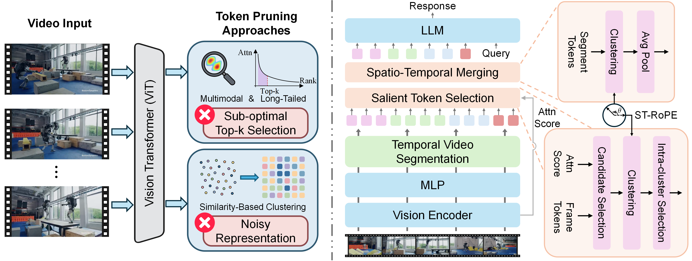

<p align="center">

</p>

<div align="center">
<h1>Tango</h1>

<div>
    <a href="#"></a>
    <a href="https://opensource.org/licenses/Apache-2.0">
    </a>
</div>

<h3>Tango: Taming Visual Signals for Efficient Video Large Language Models</h3>
</div>

**TL;DR:** We identify critical gaps in video token pruning and advance two predominant paradigms: saliency-based token selection (🔑 **signal**: attention weight) and diversity-oriented token merging (🔑 **signal**: cosine similarity).

## ✨ Highlights

**Main contributions:** We analyze the characteristics of pivotal visual signals and rethink how to utilize them more effectively (<ins>More details and findings in our paper</ins>).

<p align="center">
    
    <br>
    <em>(Left) Motivation of our method. (Right) Method overview.</em>
</p>

- **Attention Weight:** The distribution is multi-modal and long-tailed, which a vanilla Top-k strategy fails to capture accurately.
<br>
➡️ **Our approach:** Expand the candidate set (cover the tail) and perform intra-cluster selection (cover diverse modes).
- **Cosine Similarity:** Direct similarity-based clustering often creates fragmented clusters, leading to noisy representations after average pooling.
<br>
➡️ **Our approach:** Inject a spatio-temporal locality prior (for smoothness) using our proposed ST-RoPE.
  


## 🛠️ Quick Setup

1. Create a conda virtual environment and install the required packages.

```shell
conda create -n Tango python=3.10
conda activate Tango
pip install -r requirements.txt
```

2. Install Flash Attention 2.
```shell
pip install -U flash-attn --no-build-isolation
```
3. Install evaluation frameworks.
```shell
# For main performance evaluation
pip install -e ./VLMEvalKit
# For efficiency analysis
pip install -e ./lmms-eval
```

## 💡 Evaluation

### Performance Evaluation
We adopt the `VLMEvalKit` framework for performance evaluation, with retention ratios in `{0.1, 0.15, 0.2}`.

We currently support `LLaVA-OneVision-7B`, `LLaVA-Video-7B`, and `Qwen2.5-VL-7B` models.
```shell
cd VLMEvalKit/
# Evaluate on LLaVA-OneVision-7B
bash run_eval_ov.sh
# Evaluate on LLaVA-Video-7B (w/ intra-LLM pruning)
bash run_eval_video.sh
# Evaluate on Qwen2.5-VL-7B
bash run_eval_qwen.sh
```

### Efficiency Profiling
We adopt the `lmms-eval` framework for efficiency profiling.
Here's a sample script for evaluation under retention ratio `0.1`.
```shell
WRAPPER=tango accelerate launch --num_processes=8 \
  -m lmms_eval \
  --model llava_onevision \
  --model_args pretrained=lmms-lab/llava-onevision-qwen2-7b-ov,conv_template=qwen_1_5,model_name=llava_qwen,attn_implementation=flash_attention_2 \
  --tasks videomme \
  --batch_size 1 \
  --log_samples \
  --log_samples_suffix llava_onevision \
  --output_path ./logs/
```
For reference, our results with 8 NVIDIA A800 GPUs are:
| Metric                            	|   Value 	|
|-----------------------------------	|--------:	|
| Total_runtime (s)                 	| 1315.02 	|
| Total_GPU_runtime (s)             	|  198.31 	|
| Peak_mem (GB)                     	|   18.61 	|
| Avg_ViT_Time (ms)                 	|  335.57 	|
| Avg_Other_Time (ms)               	|  146.59 	|
| Avg_LLM_Prefill_Time (ms)         	|   80.64 	|
| Avg_Total_TTFT (ms)               	|  562.80 	|
| Avg_Decoding_Throughput (token/s) 	|   83.66 	|


## 🙌 Related Projects
* [Sparrow](https://github.com/VITA-MLLM/Sparrow): An efficient training scheme for video LLMs.
* [Awesome-MLLM](https://github.com/BradyFU/Awesome-Multimodal-Large-Language-Models): A project keeping track of new papers and the latest developments in the field of MLLMs.

## 🌻 Acknowledgement
- Inspiring works with open-sourced implementation: [VisionZip](https://github.com/JIA-Lab-research/VisionZip), [FastVID](https://github.com/LunarShen/FastVID), [HoliTom](https://github.com/cokeshao/HoliTom).
- Our efficiency profiling implementation is extended upon [VidCom<sup>2</sup>](https://github.com/xuyang-liu16/VidCom2).

## 🖋️ Citation

If you find our project useful, please consider citing our paper:
```
@article{yin2026tango,
  title={Tango: Taming Visual Signals for Efficient Video Large Language Models},
  author={},
  journal={},
  year={}
}
```


